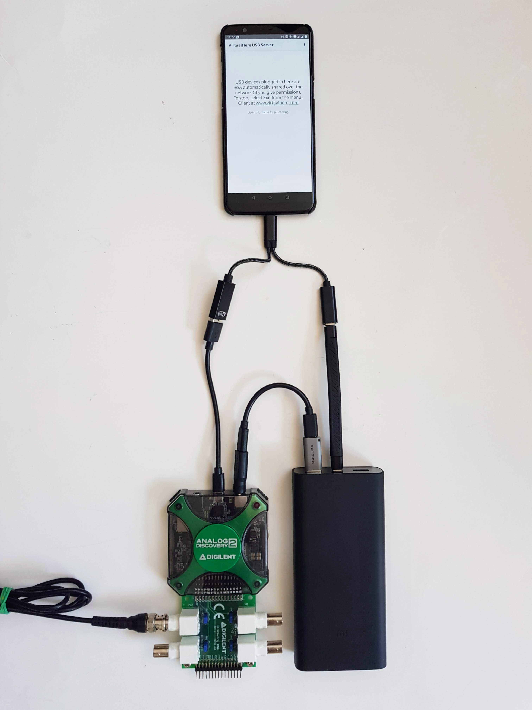

<p align="center">
  
</p>

# BBD Body Monitor

## Setup
It is highly recommended to make measurement with a battery powered setup and preferably in a electromagnetically shielded environment. Radiation from the power grid are usually the strongest, so always try to increase your subject's distance from live cables, outlets and appliances during sampling sessions. External electromagnetic radiation can distort the sampling which can lead to incorrect models in the end.

### Windows
Body Monitor on Windows can provide an excellent performance with 800k SPS, 14 bit resolution and 8192k FFT size. This enables us to have frequency domain data in every 5 seconds in the 0-400 kHz range with 0.1 Hz resolution. 

### Ubuntu

### Raspbian/Raspberry Pi OS

1) Download and install Raspbian OS by following [the official instructions](https://www.raspberrypi.com/software/)
2) Enable SSH and VNC in Preferences / Raspberry Pi Configuration / Interfaces on Raspberry


3) Download and install [a VNC client](https://www.realvnc.com/en/connect/download/viewer/windows/) on Windows
4) Connect to "raspberrypi" with the VNC client


5) [Install .NET 6](https://docs.microsoft.com/en-us/dotnet/core/install/linux-scripted-manual#manual-install) on Raspberry

```
wget https://download.visualstudio.microsoft.com/download/pr/ef1d4f88-cbe9-47c2-9fb3-e7e772be1a4c/4fbbf2a11cee4f52a478a46b1a69ed03/dotnet-sdk-6.0.300-linux-arm.tar.gz

DOTNET_FILE=dotnet-sdk-6.0.300-linux-arm.tar.gz

export DOTNET_ROOT=$(pwd)/.dotnet

mkdir -p "$DOTNET_ROOT" && tar zxf "$DOTNET_FILE" -C "$DOTNET_ROOT"

export PATH=$PATH:$DOTNET_ROOT

nano ~/.bashrc

# add these two lines to the end of the file
# export DOTNET_ROOT=$HOME/.dotnet
# export PATH=$PATH:$HOME/.dotnet

dotnet --version
```

6) Clone this repo

```
git clone https://github.com/andrasfuchs/BioBalanceDetector.git
```

7) Build the source

```
cd ~/BioBalanceDetector/Software/Source/BBDProto08/BBD.BodyMonitor
dotnet publish --configuration release --runtime linux-arm --self-contained true --output ~/BBD.BodyMonitor
```

8) Run the `bbd.bodymonitor` app

```
cd ~/BBD.BodyMonitor
./bbd.bodymonitor
```

9) Download and install [Digilent Adept Runtime](https://lp.digilent.com/complete-adept-runtime-download)
  * For Raspberry OS 32-bit: Raspberry Pi
    * To remove: `sudo dpkg --remove digilent.adept.runtime:armhf`
  * For Raspberry OS 64-bit: ARM / Download 64-bit .deb

11) Download and install [Digilent WaveForms](https://forum.digilent.com/topic/8908-waveforms-beta-download/)
  * For Raspberry OS 32-bit: digilent.waveforms*armhf.deb
    * To remove: `sudo dpkg --remove digilent.waveforms:armhf`
  * For Raspberry OS 64-bit: digilent.waveforms*arm64.deb

### Android
Using the Body Monitor on Android makes it mobile, but it still needs another computer on the same network to process and save the data. Sampling rate is limited to 250k SPS, it drains the phone battery in 30-60 minutes depending on the phone, and it needs a fast and stable WiFi in order to work.

1) Buy [a $10 OTG cable](https://www.amazon.de/-/en/UGREEN-Adapter-Laptop-Compatible-MacBook/dp/B072V9CNTK) and connect AD2 to your phone
2) Buy [the VirtualHere USB Server](https://play.google.com/store/apps/details?id=com.virtualhere.androidserver) for $25 and install it on your phone
3) Download [the VirtualHere USB Client](https://www.virtualhere.com/usb_client_software) to your Windows or Linux and run it
4) Setup your Windows or Linux as described above
5) Before you start the data acquisition make sure that you select the "Digilent USB device" in the VirtualHere client and you select "Use this device"
6) Run the `bbd.bodymonitor` as you would normally do

 
