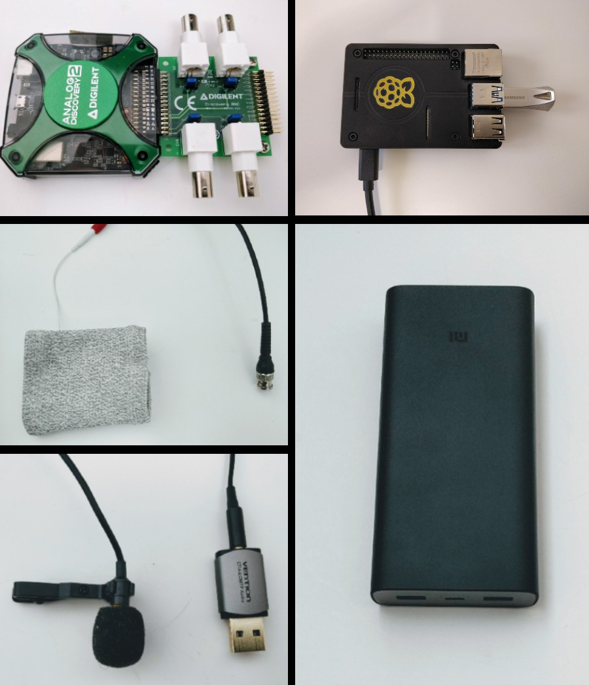

  

# BBD Body Monitor

## Technical Requirements
This is the 8th prototype of the Bio Balance Detector project. The device must record bio-potential data in a convenient and mobile way. The recorded data must be processed onboard and give audio and/or visual feedback depending on the measured data. The device must work for at least 8 hours to record sleep, and it must be battery powered to avoid the 50/60 Hz artifacts that are present in all devices that are powered from the typical power outlet. An algorithm will be developed to recognize the different states we usually have, like wakefulness, relaxation, sleeps etc. If that is successful it can be more gradual, potentially recognizing emotions like contentment, joyfulness, the flow state, anger or frustration. The long-term goal is to find correlation between these measurements and physical and mental medical conditions.

These requirements above mean:
* a small form factor
* a convenient to wear conducting material to act as the sensor
* CPU to calculate 0.25Hz resolution FFT on the fly
* enough memory to store 5 seconds of samples
* an at least 250 kHz, 14+bit resolution ADC 
* a big enough battery to operate for 8+ hours
* audio and/or visual feedback option
* audio recording for tagging/labeling
* enough storage space to save 8+ hours worth of raw FFT and audio data (~11.5 GB/hour)
* machine learning framework to recognize patterns in the digitized bio-potential data

## Hardware Components
* [Raspberry Pi 4 Model B 4GB](https://www.raspberrypi.com/products/raspberry-pi-4-model-b/)
* [Analog Discovery 2](https://digilent.com/shop/analog-discovery-2-100ms-s-usb-oscilloscope-logic-analyzer-and-variable-power-supply/)
* Silver impregnated wrist band
* [20000 mAh power bank](https://www.mi.com/global/20000mAh-mi-power-bank-3-pro/)
* USB microphone

  

## Software Components
* [Raspbian OS](https://www.raspberrypi.com/software/)/[Android](https://www.android.com/)[1] (mobile mode) or [Windows 11](https://www.microsoft.com/software-download/windows11)[2]/[Ubuntu 22](https://ubuntu.com/) (workstation mode)
* [.NET 6](https://dotnet.microsoft.com/en-us/download/dotnet/6.0)
* [ML.NET 2.0](https://dotnet.microsoft.com/en-us/apps/machinelearning-ai/ml-dotnet)
* [.NET MAUI](https://github.com/dotnet/maui) user interface[3]
* [Visual Studio](https://visualstudio.microsoft.com/) with [ML.NET Model Builder extension](https://dotnet.microsoft.com/en-us/apps/machinelearning-ai/ml-dotnet/model-builder) for model training

[1]: Accomplished by USB-over-IP, it still needs another computer on the same network to process the data.

[2]: AI model training is only supported on Windows at the moment.

[3]: Planned feature
